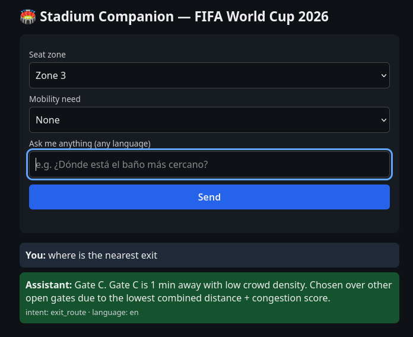
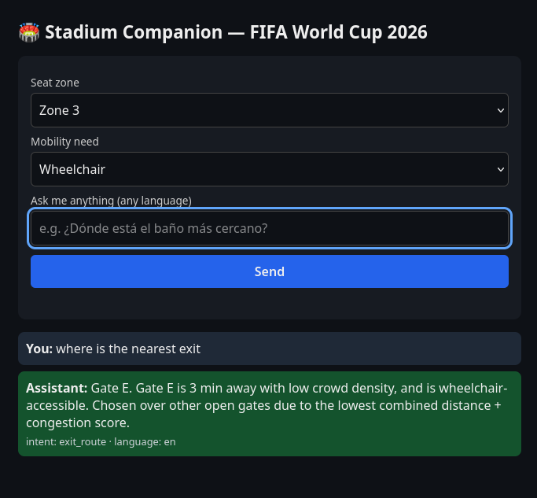
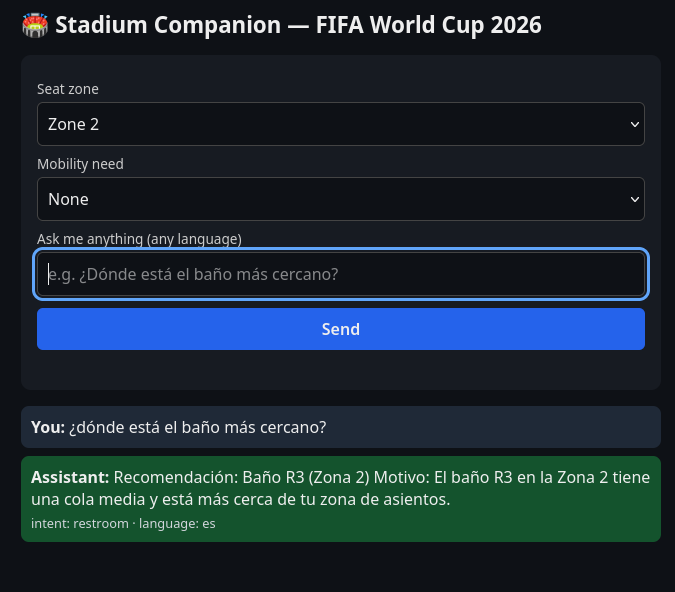

# Stadium Companion

### Prompt Wars Challenge 4 – Smart Stadiums & Tournament Operations

Building an AI-powered companion that enhances fan experience and supports real-time stadium operations during the FIFA World Cup 2026.

> A GenAI-powered smart stadium assistant that helps fans navigate complex venues through multilingual assistance, accessibility-aware routing, crowd-aware recommendations, and operational intelligence. The solution combines deterministic decision logic with LLM-powered natural language understanding to deliver explainable, context-aware recommendations for a safer and more inclusive stadium experience.

## Live Demo

**Cloud Run:** https://stadium-companion-762488706590.europe-west1.run.app
> Supports multilingual fan assistance, accessibility-aware routing, crowd-aware recommendations, and operational insights for tournament venues.

## Tech Stack

- Python 3.11
- FastAPI
- Groq API (Llama 3.3)
- Docker
- Google Cloud Run
- HTML/CSS/JavaScript
- Pydantic
- Pytest

## Features

- 🏟️ Context-aware stadium assistant
- ♿ Accessibility-aware routing for wheelchair and mobility-impaired fans
- 🚪 Crowd-aware exit recommendations
- 🚻 Queue-aware restroom recommendations
- 🍔 Food stall recommendations based on wait time and proximity
- 🚇 Transport recommendations using congestion and departure times
- 🌍 Automatic language detection with multilingual responses
- 🤖 Natural language interaction powered by Groq LLM
- 📊 Operational summary endpoint for venue staff
- ✅ Deterministic recommendation engine for transparent decision making

## Architecture

```text
                        Browser (Frontend)
                               │
                               ▼
                    FastAPI Backend (API)
                               │
              ┌────────────────┴────────────────┐
              │                                 │
              ▼                                 ▼
   Decision Engine (Deterministic)      Groq LLM
   • Accessibility Rules                • Intent Detection
   • Crowd Optimization                 • Language Detection
   • Queue Optimization                 • Multilingual Replies
              │                                 │
              └────────────────┬────────────────┘
                               ▼
                Context-Aware Stadium Recommendation
```

## AI Usage

The application intentionally separates AI from operational decision making.

### LLM Responsibilities

- Detect user intent
- Detect message language
- Generate multilingual natural-language responses

### Deterministic Decision Engine

All recommendations are produced using transparent business rules based on:

- Fan seat zone
- Accessibility requirements
- Crowd density
- Queue lengths
- Gate availability
- Transport status

This separation makes recommendations explainable, reproducible, and suitable for safety-critical environments such as large sporting events.

## Workflow

```text
Fan Question
      │
      ▼
Intent + Language Detection (Groq)
      │
      ▼
Load Stadium State
      │
      ▼
Deterministic Decision Engine
      │
      ▼
Recommendation + Reasoning
      │
      ▼
Multilingual Response
```

## Approach & Logic
Rather than covering every operational area shallowly, this solution focuses
on one high-value, well-defined slice: **context-aware, multilingual,
accessibility-first navigation and amenity guidance**.

The system is split into two deliberately separate layers:

1. **Decision engine** (`backend/decision_engine.py`) — a deterministic,
   rules-based module with no LLM involvement. Given a fan's profile
   (seat zone, mobility need) and the live stadium state (crowd density per
   gate, gate open/closed status, restroom/food queue lengths, transport
   crowd + departure times), it scores and selects the best option for:
   exit routes, restrooms, food stalls, and transport.
   Keeping this deterministic makes it auditable and unit-testable — a
   requirement for real operational trust, and directly testable per the
   evaluation criteria.

2. **LLM layer** (`backend/llm_service.py`) — handles only language
   understanding (what does the fan want, what language are they speaking)
   and language generation (phrasing the decision engine's output naturally
   in the fan's language), using Groq's free-tier API (Llama 3.3 70B). It
   never makes the actual recommendation decision itself — this avoids the
   common failure mode of LLM hallucination affecting safety-relevant
   routing decisions.

## How It Works
1. Fan enters their seat zone and mobility need, and types a question in
   any language (e.g. "¿Dónde está el baño más cercano?").
2. `/chat` endpoint detects intent + language (via Groq's API if configured,
   otherwise a keyword-based + `langdetect` fallback).
3. The decision engine computes the best recommendation using live mock
   stadium data (`data/stadium_state.json`).
4. The LLM layer phrases the response in the fan's detected language.
5. The frontend (`frontend/index.html`) displays the reply along with the
   detected intent/language for transparency, with accessible markup
   (semantic form/landmarks, visible focus states, `aria-live` regions)
   and a visible error state if the backend is unreachable.

## API Endpoints

| Endpoint | Method | Purpose |
|----------|--------|---------|
| `/health` | GET | Health check |
| `/chat` | POST | Generates personalized fan recommendations |
| `/ops/summary` | GET | Operational overview for venue staff |

## Screenshots

**Exit routing — accessibility-aware context switching:**
Same seat zone, same question — the recommended gate changes depending on
mobility need, because the objectively "best" gate (shortest distance +
lowest crowd) isn't wheelchair-accessible.

*Without a mobility need — Gate C recommended (best combined score):*


*With wheelchair selected — Gate C is excluded, Gate E recommended instead:*


**Multilingual support:**
Fan asks in Spanish, receives a fully translated, context-aware reply.


**Error handling:**
Graceful, visible failure message when the backend is unreachable —
no silent hang.


## Assumptions
- Live stadium state (crowd density, gate status, queue lengths) is mocked
  via a static JSON file (`data/stadium_state.json`) rather than a real IoT
  feed, since no live FIFA data source is available for this challenge.
  The decision engine's interface is designed so a real live-data feed could
  be swapped in without changing any decision logic.
- The app runs fully without an API key (rule-based fallback for both intent
  detection and reply phrasing), so it can be evaluated without requiring
  a secret to be configured. Setting `GROQ_API_KEY` in `.env` (free, no
  credit card required — console.groq.com/keys) enables full multilingual
  LLM-based understanding and phrasing.
- Scope is limited to fan-facing navigation/amenities/transport rather than
  attempting to also cover volunteer/organizer/venue-staff workflows, to
  keep the logic deep and well-tested rather than broad and shallow.

## Project Structure

```text
backend/
├── decision_engine.py
├── llm_service.py
├── stadium_data.py
├── models.py
└── main.py

frontend/
└── index.html

data/
└── stadium_state.json

tests/
├── test_decision_engine.py
└── test_main.py
```

## Setup & Run
```bash
python3 -m venv .venv
source .venv/bin/activate
pip install -r requirements.txt
uvicorn backend.main:app --reload
```
Open http://localhost:8000 in your browser.

## Testing
```bash
pytest tests/ -v
```
10 tests covering: accessibility exclusion, closed-gate exclusion, crowd
avoidance, restroom accessibility, queue-based food/transport selection,
unknown-input resilience, and API endpoint validation (`/health`,
`/ops/summary`, `/chat`).

## Security Notes
- No API keys are hardcoded; `.env` is gitignored.
- CORS is restricted to the deployed Cloud Run origin and localhost —
  wildcard origins are not used in production.
- All external input (fan message, profile) is validated via Pydantic models.
- Frontend escapes all user-provided text before rendering (XSS prevention).
- Container image is scanned for vulnerabilities via Google Cloud's
  Container Scanning API.

## Limitations / Future Work

- Integrate live IoT crowd and transport feeds.
- Indoor GPS navigation for turn-by-turn guidance.
- Voice interaction for hands-free accessibility.
- Personalized notifications during the event.
- Predictive crowd congestion analytics.
- Expanded operational dashboards for volunteers and venue staff.
